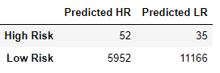
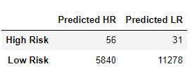
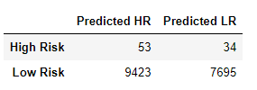
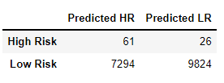
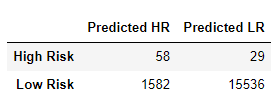
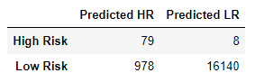

# ML_Credit_Risk_Analysis

Credit risk is an inherently unbalanced classification problem, as good loans easily outnumber risky loans. The purpose of this project is to employ different techniques to train and evaluate models with unbalanced classes.

- Deliverable 1: Use Resampling Models to Predict Credit Risk
  - Oversample with RandomOverSampler and SMOTE algorithms
  - Undersample with ClusterCentroid algorithm
- Deliverable 2: Use the SMOTEENN Algorithm to Predict Credit Risk
  - BalancedRandomForestClassifier
  - EasyEnsembleClassifier
- Deliverable 3: Use Ensemble Classifiers to Predict Credit Risk
- Deliverable 4: A Written Report on the Credit Risk Analysis (README.md)

## Results

Below are the results comparing the different algorithms (run on the logistic regression model):

### Random Oversampling

- Accuracy score: 0.62
- Precision: High risk: 0.01; Low risk: 1.00
- Recall: High risk: 0.62; Low risk: 0.65
- F1 Score: 0.78
- Confusion matrix: 

### SMOTE Oversampling

- Accuracy score: 0.65
- Precision: High risk: 0.01; Low risk: 1.00
- Recall: High risk: 0.64; Low risk: 0.66
- F1 Score: 0.79
- Confusion matrix: 

### Cluster Centroid Undersampling

- Accuracy score: 0.53
- Precision: High risk: 0.01; Low risk: 1.00
- Recall: High risk: 0.61; Low risk: 0.45
- F1 Score: 0.62
- Confusion matrix:

### SMOTEENN Resampling

- Accuracy score: 0.64
- Precision: High risk: 0.01; Low risk: 1.00
- Recall: High risk: 0.70; Low risk: 0.57
- F1 Score: 0.73
- Confusion matrix: 

### Balanced Random Forest Ensemble Classifier

- Accuracy score: 0.79
- Precision: High risk: 0.04; Low risk: 1.00
- Recall: High risk: 0.67; Low risk: 0.91
- F1 Score: 0.95
- Confusion matrix:

### AdaBoost Ensemble Classifier

- Accuracy score: 0.93
- Precision: High risk: 0.07; Low risk: 1.00
- Recall: High risk: 0.91; Low risk: 0.94
- F1 Score: 0.97
- Confusion matrix:

## Summary

Observations: 

- A highly sensitive model will find all the low risk borrowers and miss-classify some high risk borrowers as safer than they are. 
- A highly precise model will not capture all low risk borrowers, but will avoid the false-positive identification of risky borrowers. Lenders should employ models with high precision in order to minimize approval of high-risk borrowers.

- The AdaBoost Ensemble Classifier is the best choice for high-risk borrower classification. AdaBoost' s accuracy score of  93% indicates the model almost accurately classified borrowers. Additionally, the high F1 score indicates a relative balance between precision and sensitivity.
-  Balanced Random Forest ensemble was the second-best at 79%, accuracy, but with higher precision in high-risk classification compared to AdaBoost. This model performed better than the resampling models. 
- All the resampling algorithms: oversampling, undersampling, and combo-SMOTEENN showed low accuracy and precision.